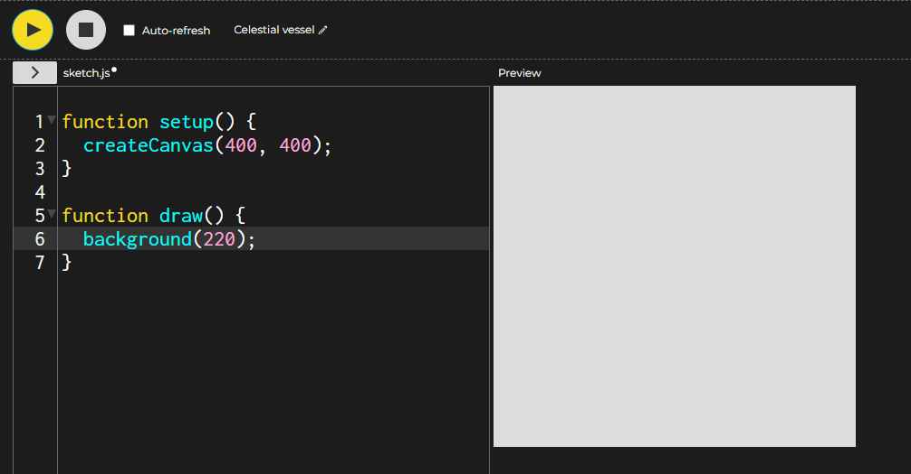
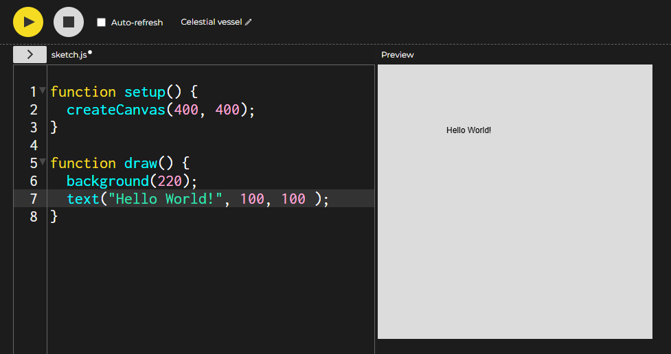

<html>
<head>
<link rel="stylesheet" type="text/css" href = "style.css">
</head>
<body>

# Day 1: Drawing and Colors

## Brainstorming / Rough Work :warning: Eventually Remove This Part:warning:

- Drawing commands
- Explanation of colors
- How to find specific colors

## Quick Links
[Progress Pics](#what-should-it-look-like)  
[Instructions](#instructions)  
[Next Steps](#next-steps)  

## Introduction
Every wanted to make a game? In the next three lessons we will cover the basics to make a simple click game.  
While this seems like a simple game, it will have all the elements of a game and hopefully we will be able to get far enough that you will be able to improve upon it.

Today we cover how to make things appear in your game.  We will cover the basics of position, drawing, and colors.  

You will use your skills to make a character like this.  Along the way, we will cover important topics such as the color types and how to position shapes.

### What should it look like?
Stage 1

Stage 2

Stage 3 

Stage 4

## Instructions
>  When you ***note*** something we will start the line with a bullet
>  When you should ***do*** something we will start the line with a number.
### Getting Started
1. Go to the link [https://editor.p5js.org/](https://editor.p5js.org/)
3. Have your STEAM Academy partner signin to make sure your work is not lost.  They can email your work to you later. Or you can have your parents help you sign up later.
- You should have something on your screen that looks like the image on the right:  
  <figure>
    
    <figcaption>Hover over to see a larger image</figcaption>
</figure>  

###  Overview of the P5 Coding Environment.
- Notice the two buttons at the top left corner.  
  - The play button runs your program and the stop button stops it.
- You will see your code beneath the buttons.  
- Notice there are line numbers beside the lines of code.  
    - The line numbers will make it easy for you to find errors and help tell you where to type in new lines of code.
- Notice there are two groups of code that start with the word `function`.
  - The setup function runs once at the beginning
    - Right now the setup function just contains making the game canvas.
  - The draw function runs over and over 60 frames per seconds.
    - Most of your code will go in here.
    - Right now it has a line that makes the background grey.  
1. Press play.
   - You should see in the preview section a grey rectangle.  
### Hello World!
- By tradition, the first thing you should do in a new coding language is say "Hello World!".
1. Click on the end of line 6 and press `enter` to give yourself a new line to type into. 
2. Type in the command exactly: `text("Hello World!", 100, 100 );`  
3. Press play.  
- Your preview should look like the image on the right (hover over to see a larger image):  
<figure>
    
    <figcaption>Hover over to see a larger image</figcaption>
</figure>  

- You should notice a couple of things.  
    - The text was black and kind of small.
    - The text is on the top leftish corner.
### Changing Things
- We can change the settings that are used to make the text and any other text that we make after.
  - The way we speak is we say that we ***call functions***.  
- Functions are code that someone else made for us to use to do some task. 
- We never see the code behind it but if we know the name and what the function needs to do its job, then it will work.
    - Kind of like Harry Potter saying a spell.
      - But its easier and it always works (even if you're Ron Weasly)  
- Let's first say the spell (I mean call the function) to make the text bigger.
1. Make a new line just before the text function on line 7. 
2. Type in the following function exactly: `textSize(40);` and press play again.
- If successful, your preview should look like this: 
<figure>
    
    <figcaption>Hover over to see a larger image</figcaption>
</figure>  
!Coordinates (especially y)!
!Hexidecimal!
!Color pickers!
!Transparency!
!Position by center or by corner!

## Explore / Next Steps 
[P5 Tutorials page](https://p5js.org/tutorials/)
[P5 Example page](https://p5js.org/examples/)
</body>
</html>