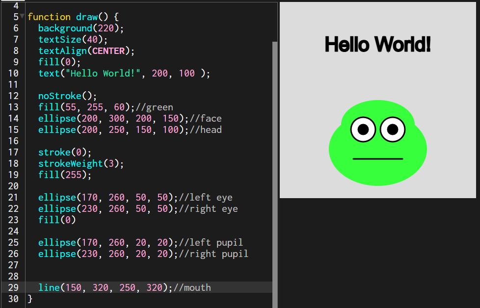
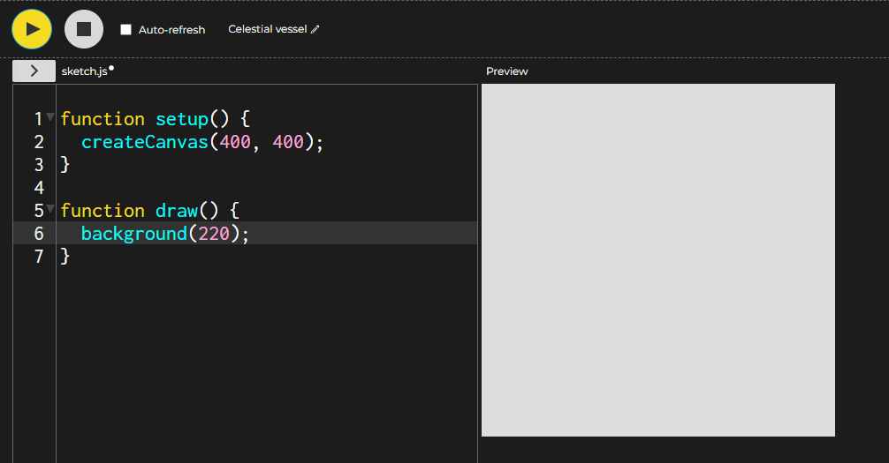
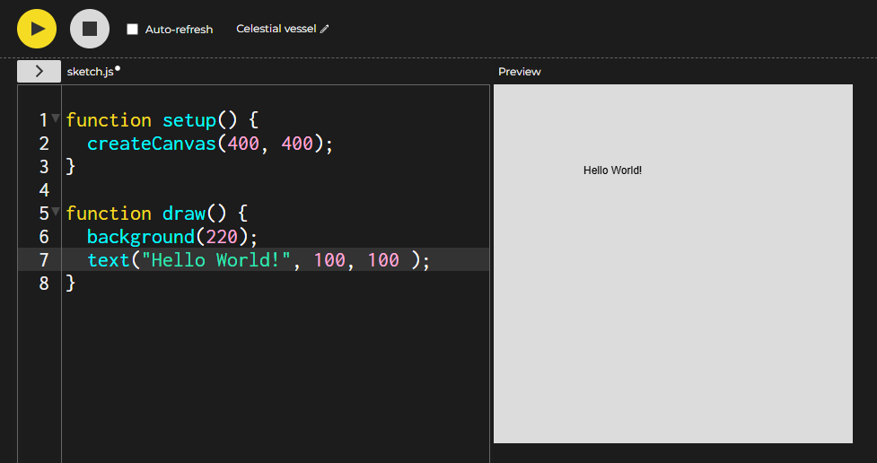
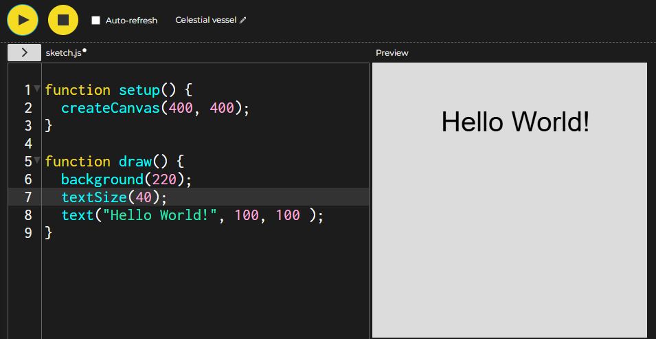
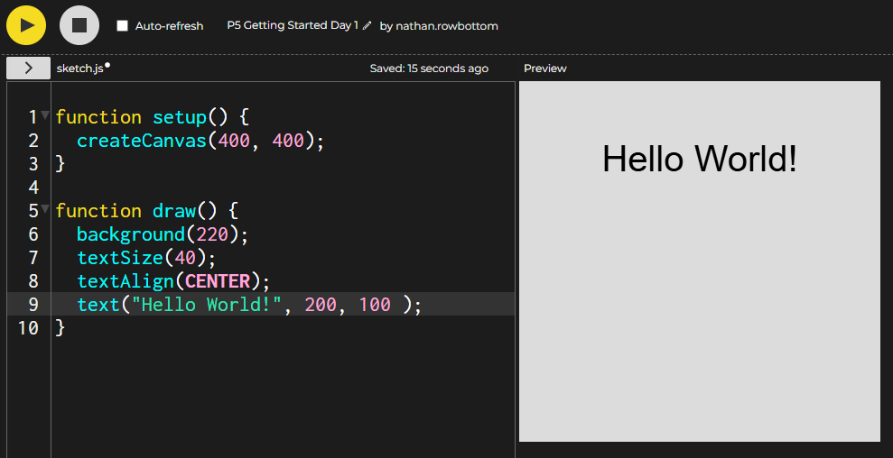
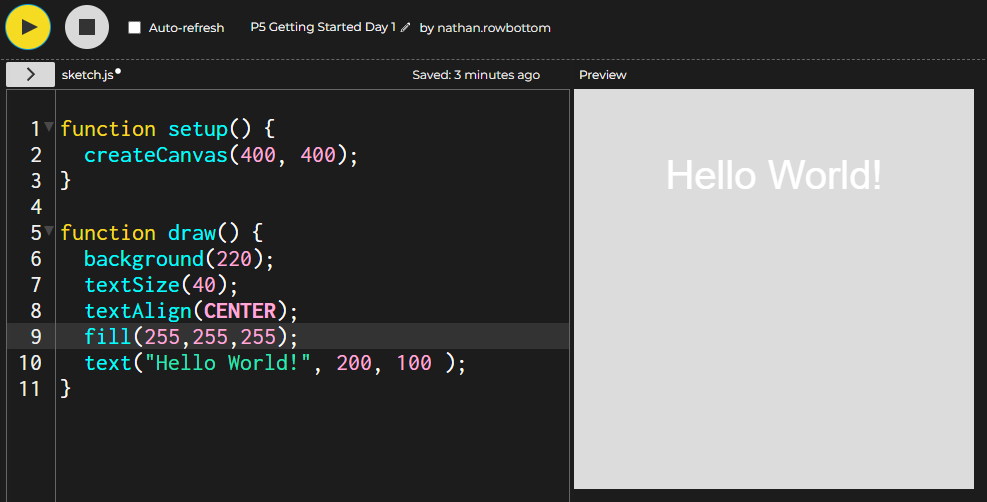
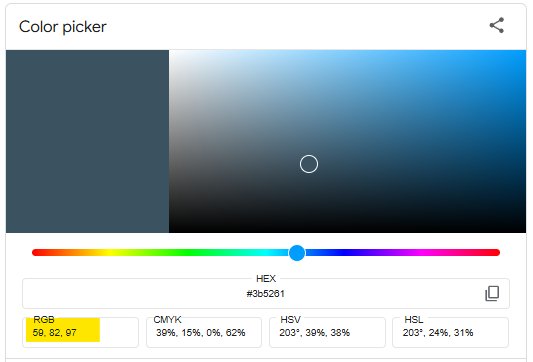

<html>
<head>
<link rel="stylesheet" type="text/css" href = "style.css">
</head>
<body>

# Day 1: Drawing and Colors

## Quick Links
[Progress Pics](#what-should-it-look-like)  
[Instructions](#instructions)  
[Next Steps](#next-steps)  

## Introduction
Ever wanted to make a game? 
In the next three lessons we will cover the basics to make a simple click game.  
While this seems like a simple game, it will have all the elements of a game and hopefully we will be able to get far enough that you will be able to improve upon it.

Today we cover how to make things appear in your game.  We will cover the basics of position, drawing, and colors.  

You will use your skills to make a character like this.  

<figure>
     
     <figcaption>Hover over to see a larger image</figcaption>
 </figure>

Along the way, we will cover important topics such as the color types and how to position shapes.

## Instructions
>  When you should make a ***note***, the line will start with a bullet.  
>  When you should ***follow*** an instruction, the line will start with a number.  
### Getting Started
1. Go to the link [https://editor.p5js.org/](https://editor.p5js.org/)
3. Have your STEAM Academy partner signin to make sure your work is not lost.  They can email your work to you later. Or you can have your parents help you sign up later.
- You should have something on your screen that looks like the image on the right:  
  <figure>
    
    <figcaption>Hover over to see a larger image</figcaption>
</figure>  

###  Overview of the P5 Coding Environment.
- Notice the two buttons at the top left corner.  
  - The play button runs your program and the stop button stops it.
- You will see your code beneath the buttons.  
- Notice there are line numbers beside the lines of code.  
    - The line numbers will make it easy for you to find errors and help tell you where to type in new lines of code.
- Notice there are two groups of code that start with the word `function`.
  - The setup function runs once at the beginning
    - Right now the setup function just contains making the game canvas.
  - The draw function runs over and over 60 frames per seconds.
    - Most of your code will go in here.
    - Right now it has a line that makes the background grey.  
1. Press play.
   - You should see in the preview section a grey rectangle.  
### Hello World!
- By tradition, the first thing you should do in a new coding language is say "Hello World!".
1. Click on the end of line 6 and press `enter` to give yourself a new line to type into. 
2. Type in the command exactly: `text("Hello World!", 100, 100 );`  
3. Press play.  
- Your preview should look like the image on the right (hover over to see a larger image):  
<figure>
    
    <figcaption>Hover over to see a larger image</figcaption>
</figure>  

- You should notice a couple of things.  
    - The text was black and kind of small.
    - The text is on the top leftish corner.
### Changing Things
- We can change the settings that are used to make the text and any other text that we make after.
  - The way we speak is we say that we ***call functions***.  
- Functions are code that someone else made for us to use to do some task. 
- We never see the code behind it but if we know the name and what the function needs to do its job, then it will work.
    - Kind of like Harry Potter saying a spell.
      - But its easier and it always works (even if you're Ron Weasly)  
- Let's first say the spell (I mean call the function) to make the text bigger.  

1. Make a new line just before the text function on line 7. 
2. Type in the following function exactly: `textSize(40);` and press play again.
  - If successful, your preview should look like this: 
 <figure>
     
     <figcaption>Hover over to see a larger image</figcaption>
 </figure>

 - Note that the function to increase the font size has to be above the line that make the text.
 - Feel free to mess around with the number and see how big and small you can make the text.
 - After you have completed changing the text size Some other functions you can call to change the text and some other values you could try:
   - `textAlign(RIGHT);`

 - Make sure to leave the text aligned in the center. 
### Positioning the Text
 - Now try let's changing the position of the text.
1. Change the text line from `text("Hello World", 100, 100);` to `text("Hello World", 300, 100);`
2. Press play again.
 - Notice the text moved to the right.  
   - The first number represents the sideways or 'x' position of the text.  
   - The second number is the vertical or 'y' position.
   - Notice to make something go down means to increase the 'y' value;
3. Add a new line above the text command typed exactly: `textAlign(CENTER);`.
 - This command centers the text around the position.
4. Change the values for x and y until you feel confident you have the text centered in the middle of the screen but in the top quarter of the screen.
 - Your text should look similar to this:
 <figure>
     
     <figcaption>Hover over to see a larger image</figcaption>
 </figure>

### Filling and Colors
- The color used to make the text and fill in shapes is preset as black but can be changed to any color by calling the `fill` function.
1. Make a new line above the text command and type in `fill(255,255,255);` and press play.
 - Your text should look similar to the image on the right:
 <figure>
     
     <figcaption>Hover over to see a larger image</figcaption>
 </figure>

 - Notice the text is white now. 
 - The fill function lets you change the colour in multiple ways.
     
1. *One number between 0 and 255* 
      - Example: `fill(100);` 
      - Changes the colour to a shade of grey between black (0) and white (255).
      
2. *Three numbers between 0 and 255* 
   - Example: `fill(100, 50, 150);` 
   - The 1st number if the amount of red, the 2nd number is the amount of green, the 3rd number is the amount of blue.
   - They call three values **RGB** which stands for **RED, GREEN, BLUE**.
   - You can make almost any color the human eye can see.

3. *Four numbers between 0 and 255* 
   - Example: `fill(100, 50, 150, 100);` 
   - The first 3 values are RGB, but the 4th number is how transparent the colour is.

|Color| RGB values| Fill Function| Background Function|
|---|---|---|---|
|Red|(255, 0, 0)|`fill(255, 0, 0);`|`background(255, 0, 0);`|
|Green|(0, 255, 0)|`fill(0, 255, 0);`|`background(0, 255, 0);`|
|Blue|(0, 0, 255)|`fill(0, 0, 255);`|`background(0, 0, 255);`|
|Yellow|(255, 255, 0)|`fill(255, 255, 0);`|`background(255, 255, 0);`|
|Cyan|(0, 255, 255)|`fill(0, 255, 255);`|`background(0, 255, 255);`|
|Magenta|(255, 0, 255)|`fill(255, 0, 255);`|`background(255, 0, 255);`|
> The background function lets you change the color of the background with the same values.  
> A tool you can use to find the colour values you want is the Google Color Picker tool. 
> Pick a color and get the RGB values   
> [Google Color Picker](https://www.google.com/search?q=colorpicker&sourceid=chrome&ie=UTF-8&safe=active&ssui=on)  
> Explore the colors and don't work about breaking anything.
 <figure>
     
     <figcaption>Hover over to see a larger image</figcaption>
 </figure>

## Drawing Shapes

We are going to draw shapes using the functions ellipse, line and rect.  
All shapes are with the fill color last set by the fill command and with an outline last set by the stroke function.

|Function |Example |What It Does|
|---|---|---|
| noFill | noFill() | Turns off any filling of shapes or text.|
| noStroke | noStroke() | Turns off any lines or outlines.|
| stroke| stroke(255,0,0)| Sets the color for outlines and lines (and turns it back on if it was turned off).|
| strokeWeight| strokeWeight(1) | Sets the thickness of the lines and outlines in pixels.
| ellipse | ellipse(100, 200, 50, 40)| Makes a circle or oval at the position set by the first two numbers as x and y. The second pair of numbers if the width and height. |
| line | line (100, 100, 200, 200)| Draws a line from the first set of x and y position numbers to the second set of x and y position numbers.|
|rect| rect(100, 200, 50, 40)| Makes a rectangle using the first two points to set the position of the rectangle and the next two numbers are the width and height.|
|rectMode| rectMode(CENTER)| Sets whether the position of the rectangle is based on the top left corner or the center of the rectangle.|

### Draw Your Character
On the right is a little frog character I drew using the commands above.  

<figure>
     
     <figcaption>Hover over to see a larger image</figcaption>
 </figure>

1. Type the commands out and make your own little dude! 
2. Save the sketch and have your partner download the file to a USB stick.
3. Later, draw your own and bring it back next week to show off.
 
## Explore / Next Steps 

!Make a chart of commands so far???!  
[P5.js Reference Page](https://p5js.org/reference/)  
[P5.js Tutorials Page](https://p5js.org/tutorials/)  
[P5.js Examples page](https://p5js.org/examples/)
</body>
</html>